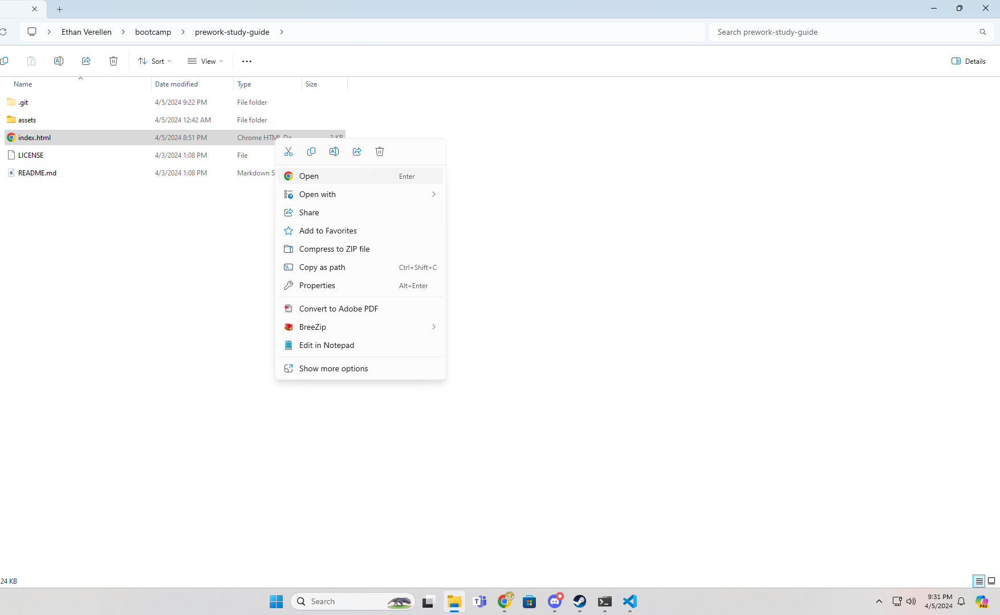

# prework-study-guide

## Description

This is a basic study guid that was used to learn how to code and as a note for if I need to lookback on the basics.  The assignment was a great way to go over the basics and get on the same page as the other students.  It taught me the basics of HTML. Css and Javascript as well as helping me get confertable with Git and Git bash.

## Installation

To instal this website bleas start with downloading the code and unziping it by extracting it.

## Usage

To use this code, you will open the file you extracted in the previous step, and find the file labled index.html.  You will right click it and select open with.  You should then open with either a coding program or a browser, depending o the desired usage.

## Credits

This entire program was made by following a bootcamp from Michigan State University.  To join go to https://bootcamp.msu.edu/ and select coding.

## License

Refer to the license that is in the same folder as this file
